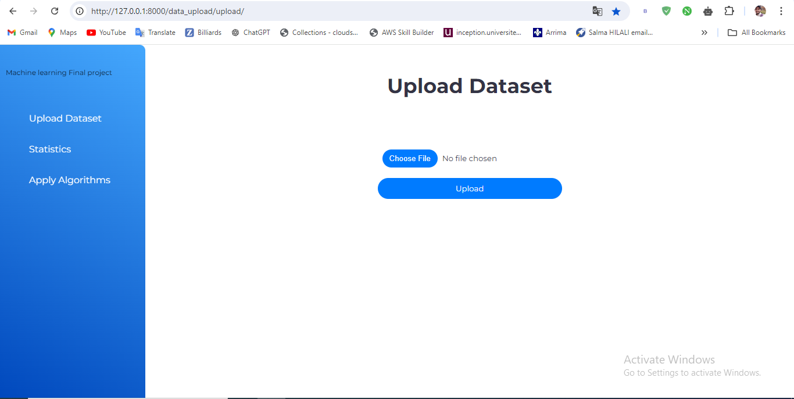
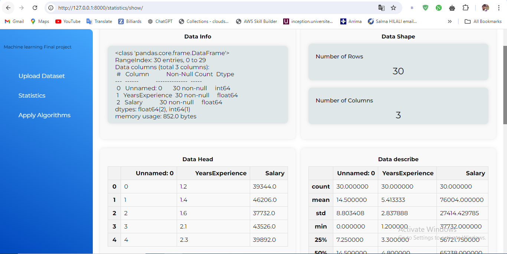
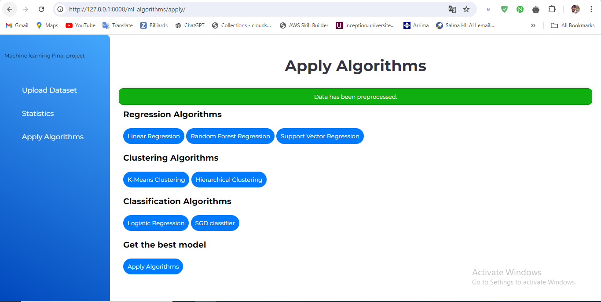

    

    
    
    

<h1>Machine Learning Project</h1>

Cette application web basée sur Django sert de plateforme conviviale pour effectuer des tâches essentielles d'apprentissage automatique. Le projet permet aux utilisateurs de télécharger des ensembles de données, d'analyser des données statistiques et d'appliquer divers algorithmes d'apprentissage automatique.

<h2>Fonctionnalités</h2>
<ul>
  <li><strong>Upload Dataset :</strong> Les utilisateurs peuvent télécharger leurs ensembles de données via une interface simple et intuitive.</li>
  <li><strong>Data Statistics :</strong> Après le téléchargement, l'application fournit des informations statistiques détaillées sur l'ensemble de données, y compris la forme des données, les types de colonnes, et des statistiques descriptives de base.</li>
  <li><strong>Apply Algorithms :</strong> Les utilisateurs peuvent appliquer plusieurs algorithmes d'apprentissage automatique directement via l'interface. Les algorithmes pris en charge incluent :
    <ul>
      <li>Régression : Régression linéaire, Régression par forêt aléatoire, Régression par vecteur de support</li>
      <li>Clustering : Clustering par K-means, Clustering hiérarchique</li>
      <li>Classification : Régression logistique, Classifieur SGD</li>
    </ul>
  </li>
</ul>

<h2>Installation</h2>
<ol>
  <li>Clonez le dépôt :
    <pre><code>git clone https://github.com/your-username/your-repo.git
cd your-repo</code></pre>
  </li>
  <li>Installez les dépendances requises :
    <pre><code>pip install -r requirements.txt</code></pre>
  </li>
  <li>Lancez le serveur :
    <pre><code>python manage.py runserver</code></pre>
  </li>
  <li>Accédez à l'application via votre navigateur à <code>http://127.0.0.1:8000/</code>.</li>
</ol>

<h2>Utilisation</h2>
<ul>
  <li>Allez dans la section <strong>Upload Dataset</strong> pour télécharger votre ensemble de données.</li>
  <li>Consultez les statistiques de l'ensemble de données dans la section <strong>Statistics</strong>.</li>
  <li>Appliquez des algorithmes d'apprentissage automatique dans la section <strong>Apply Algorithms</strong> et consultez les résultats.</li>
</ul>

<h2>Technologies utilisées</h2>
<ul>
  <li><strong>Django :</strong> Framework web</li>
  <li><strong>Pandas :</strong> Manipulation et analyse de données</li>
  <li><strong>Scikit-learn :</strong> Algorithmes d'apprentissage automatique</li>
  <li><strong>Bootstrap :</strong> Style front-end</li>
</ul>

## Captures d'écran

